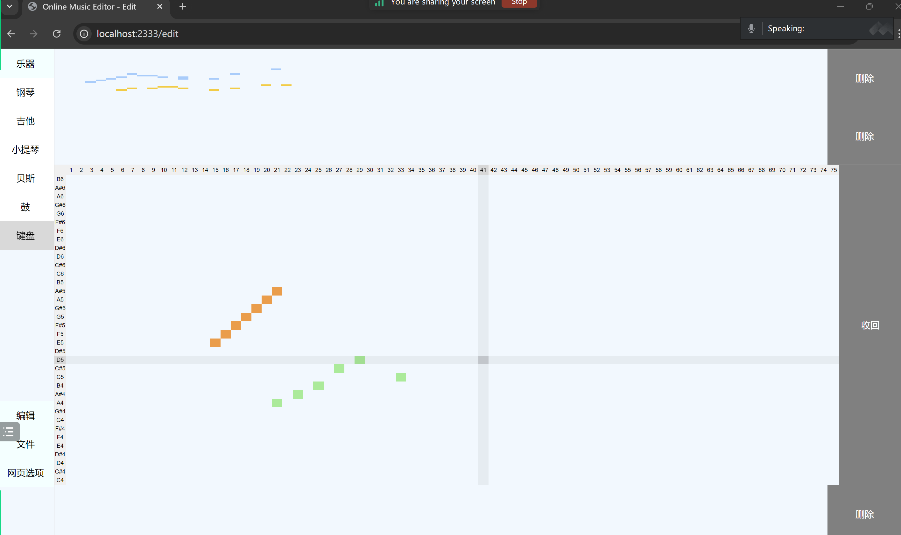

# Online Electronic Music Editor

## Introduction

This project implements an online simple electronic music editing and creation platform with playback capabilities. It supports multi-user community sharing and real-time collaborative editing. Addressing the high learning curve of current electronic music editors and the desire for quick and easy music creation, this project offers a low-barrier solution.

## Features

- **Online Editing**: Users can create and edit electronic music directly in the browser without the need to install any software.
- **Real-Time Collaboration**: Supports simultaneous online editing by multiple users with synchronized editing states for real-time collaboration.
- **Community Sharing**: Users can enjoy the music works made by each other in the gallery.
- **Low Latency Playback**: Ensures real-time response during editing and playback, providing a smooth user experience.
- **User-Friendly Interface**: A simple and intuitive interface design lowers the learning curve, enabling users to get started quickly.

## Installation and Usage

If you want to deploy the service in your computer, you can follow these steps.

1. **Install dependencies**:

    ```bash
    npm init -y
    ```

    You may need to install some npm packages later according to the output in the terminal.

2. **Clone the repository**:

    ```bash
    mkdir source
    cd source
    git clone https://github.com/NigelConkeller/online-music-editor.git
    ```

3. **Start the application**:

   Start frontend server:
    ```bash
    node source/frontend/server.js
    ```
    
    Start backend server:
    ```bash
    node source/backend/server.js
    ```

4. **Access the application**:

    Open `http://<Your server IP>:2333/login` in your browser to start using the application.

## Contribution Guidelines

We welcome suggestions and code contributions to this project. Please follow these steps to contribute:

1. Fork this repository.
2. Create your feature branch (`git checkout -b feature/AmazingFeature`).
3. Commit your changes (`git commit -m 'Add some AmazingFeature'`).
4. Push to the branch (`git push origin feature/AmazingFeature`).
5. Create a new Pull Request.

Thank you for your interest and support! If you have any questions or suggestions, feel free to reach out.

## Effect Display

Here are some images to showcase the effects:


